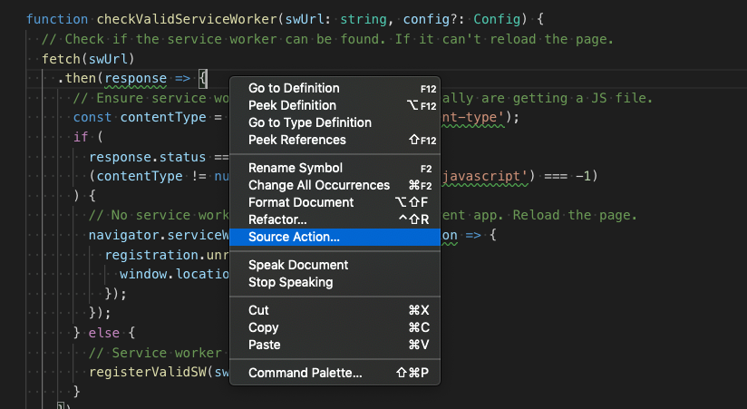

[](https://marketplace.visualstudio.com/items?itemName=ms-vscode.vscode-typescript-tslint-plugin)

Adds [tslint](https://github.com/palantir/tslint) to VS Code using the [TypeScript TSLint language service plugin](https://github.com/Microsoft/typescript-tslint-plugin).

Please refer to the [tslint documentation](https://github.com/palantir/tslint) for how to configure the linting rules.

## Usage

> ❗ **Important**: This now only supports projects using TypeScript **3.2.0 or newer**. You may enable the deprecated [vscode-TSLint][vscode-tslint] extension for projects using older versions of TypeScript, but please [disable one of the extensions][disable-extension] in your workspaces to avoid linting files twice.

This extension works using VS Code's built-in version of TypeScript and a local or global install of tslint. You do not need to configure the plugin in your `tsconfig.json` if you are using VS Code's version of TypeScript.

If you are using VS Code 1.30 or older and are [using a workspace version of typescript](https://code.visualstudio.com/Docs/languages/typescript#_using-newer-typescript-versions), you must currently configure the TS Server plugin manually by following [these instructions][configuration]

## Configuration

You can either configure the TSLint extension using a `tsconfig` or `jsconfig` as described [here][configuration], or configure it with VS Code settings. Note the VS Code based configuration overrides the `tsconfig` or `jsconfig` configuration.

 * `tslint.configFile` - The configuration file that tslint should use instead of the default tslint.json. A relative file path is resolved relative to the project root.

 * `tslint.jsEnable` - Enable/disable tslint for `.js` files. Default is `false`.

 * `tslint.ignoreDefinitionFiles` - Control if TypeScript definition files should be ignored. Default is `true`.

 * `tslint.exclude` - A glob or an array of globs. Any file matching these globs will not be linted.

 * `tslint.alwaysShowRuleFailuresAsWarnings` - Always show rule failures as warnings, ignoring the severity configuration in the tslint.json configuration.

 * `tslint.suppressWhileTypeErrorsPresent` - Suppress tslint errors from being reported while other errors are present.

### Auto fix and auto fix on save

Some simple errors can be automatically fixed by tslint using the `source.fixAll.tslint` source code action in VS Code. To run this, either run the `Source Action...` command in the command palette or right click in the TS file and select `Source Action...` from the context menu:



To enable auto fixing tslint errors on save, In VS Code set:

```json
"editor.codeActionsOnSave": {
    "source.fixAll.tslint": true
}
```

You can also setup a keybinding for tslint auto fix:

```json
{
  "key": "cmd+k f",
  "command": "editor.action.codeAction",
  "args": {
    "kind": "source.fixAll.tslint",
    "apply": "first"
  }
}
```

## Differences with the [vscode-TSLint][vscode-tslint] extension

- The implementation as a TypeScript server plugin enables sharing the program representation with TypeScript. This is more efficient than the current `vscode-tslint` implementation. The current TSLint implementation needs to reanalyze a document that has already been analyzed by the TypeScript language server. 

- `vscode-tslint` can only lint one file a time. It therefore cannot support [semantic tslint rules](https://palantir.github.io/tslint/usage/type-checking/) that require the type checker. The language service plugin doesn't have this limitation. To overcome this limitation is a key motivation for reimplementing the extension.

- This implementation supports newer versions of TypeScript.

[vscode-tslint]: https://marketplace.visualstudio.com/items?itemName=eg2.tslint
[configuration]: https://github.com/Microsoft/typescript-tslint-plugin#configuration-options
[disable-extension]: https://code.visualstudio.com/docs/editor/extension-gallery#_disable-an-extension
