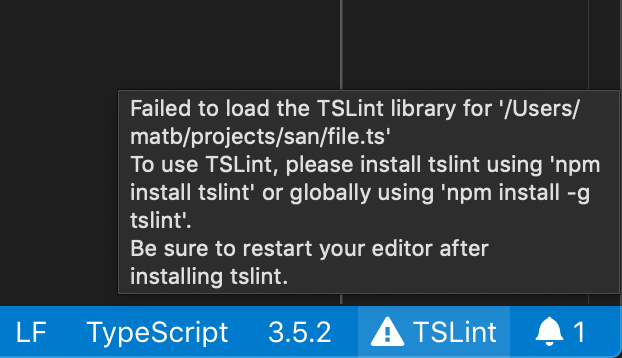

[](https://marketplace.visualstudio.com/items?itemName=ms-vscode.vscode-typescript-tslint-plugin)

> **❗IMPORTANT**: TSLint [has been deprecated](https://medium.com/palantir/tslint-in-2019-1a144c2317a9) in favor of ESLint and this extension has also been deprecated in favor of ESLint's tooling.
>
> Please look into [migrating your projects to ESLint](https://github.com/typescript-eslint/typescript-eslint#typescript-eslint).

Adds [tslint](https://github.com/palantir/tslint) to VS Code using the [TypeScript TSLint language service plugin](https://github.com/Microsoft/typescript-tslint-plugin).

Please refer to the [tslint documentation](https://github.com/palantir/tslint) for how to configure the linting rules.

## Usage

> ❗ **Important**: If you also have the [vscode-tslint][vscode-tslint] extension in VS Code installed, please disable it to avoid linting files twice.*

This extension works using VS Code's built-in version of TypeScript and a local or global install of tslint. You do not need to configure the plugin in your `tsconfig.json` if you are using VS Code's version of TypeScript.

If you are using VS Code 1.30 or older and are [using a workspace version of typescript](https://code.visualstudio.com/docs/typescript/typescript-compiling#_using-the-workspace-version-of-typescript), you must currently configure the TS Server plugin manually by following [these instructions][configuration]

## Workspace Library Execution

By default this extension will not load TSLint or custom rules from your workspace if you are using a global version of TypeScript. This is done for security reasons. The extension always allows using globally installed versions of TSLint (`npm install -g tslint`).

To use enable using a local TSLint install and custom rules from the workspace, you must either:

- Use a workspace version of TypeScript that is installed alongside TSLint.

- Enable workspace library execution by running the `TSLint: Manage Workspace Library Execution` command.

If the extension detects a workspace version of TSLint, it will show a warning in the editor and in the status bar. You can click on the status bar entry to configure Workspace Library Execution as well.

## Configuration

You can either configure the TSLint extension using a `tsconfig` or `jsconfig` as described [here][configuration], or configure it with VS Code settings. This requires VS Code 1.30+ and TS 3.2+. Note the VS Code based configuration overrides the `tsconfig` or `jsconfig` configuration.

 * `tslint.configFile` - The configuration file that tslint should use instead of the default tslint.json. A relative file path is resolved relative to the project root.

 * `tslint.jsEnable` - Enable/disable tslint for `.js` files. Default is `false`.

 * `tslint.ignoreDefinitionFiles` - Control if TypeScript definition files should be ignored. Default is `true`.

 * `tslint.exclude` - A glob or an array of globs. Any file matching these globs will not be linted.

 * `tslint.alwaysShowRuleFailuresAsWarnings` - Always show rule failures as warnings, ignoring the severity configuration in the tslint.json configuration.

 * `tslint.suppressWhileTypeErrorsPresent` - Suppress tslint errors from being reported while other errors are present.

### Auto fix and auto fix on save

Some simple errors can be automatically fixed by tslint using the `source.fixAll.tslint` source code action in VS Code. To run this, either run the `Source Action...` command in the command palette or right click in the TS file and select `Source Action...` from the context menu:


To enable auto fixing tslint errors on save, In VS Code set:

```json
"editor.codeActionsOnSave": {
    "source.fixAll.tslint": true
}
```

You can also setup a keybinding for tslint auto fix:

```json
{
  "key": "cmd+k f",
  "command": "editor.action.codeAction",
  "args": {
    "kind": "source.fixAll.tslint",
    "apply": "first"
  }
}
```

### Allowing comments in `tslint.json` files
TSlint allows `// comments` in `tsconfig.json` files but it does not allow trailing commas. In order to help you catch errors with trailing commas, this extension opts to treat `tslint.json` files as standard json by default. However this also means that you will see errors report for comments.

If you use comments in your `tsconfig.json`, you can configure VS Code to treat the file as json+comments by setting:

```json
"files.associations": {
    "tslint.json": "jsonc"
}
```

However keep in mind that VS Code's json+comments mode will not report errors for trailing commas which will cause TSLint to error when loading the `tsconfig.json`.

### Debugging why tslint is not working

If you are not seeing TSLint working in your project—such as TSLint errors not showing up—you can follow these steps to investigate what may be going wrong.

If there is a `tslint.json` in the workspace but we can't find the `tslint` executable in your workspace, you should see a TSLint warning icon in the status bar. Hover over this icon to see why TSLint is not enabled and how to fix it.



In these cases, there should also be a warning on the first line of every TypeScript files with the same information:


You can also try checking the TypeScript server logs to see why TSLint is not working:

1. In your VS Code user or workspace settings, set `"typescript.tsserver.log": "terse"`.
1. Open a TS file that you believe should have TSLint enabled
1. In the VS Code command palette, run `TypeScript: Open TS Server Log`
1. This should open a `tsserver.log` file in the editor

In the log file, look for lines that start with `[typescript-tslint-plugin]`. These indicates that the extension is active and may also contain additional information about why TSLint is not working as you expect.

If you do not see log entries with `[typescript-tslint-plugin]`, you can also check to see if the plugin itself is being loaded properly. In the logs, look for the section starting with:

```
Loading global plugin typescript-tslint-plugin
Info 21   [15:28:11.970] Enabling plugin typescript-tslint-plugin from candidate paths: ...
```

And see if there are any errors about not being able to load the plugin.

If you can't figure out why TSLint is not loading properly after looking through the logs, please open an issue.

## Differences with the [vscode-TSLint][vscode-tslint] extension

- The implementation as a TypeScript server plugin enables sharing the program representation with TypeScript. This is more efficient than the current `vscode-tslint` implementation. The current TSLint implementation needs to reanalyze a document that has already been analyzed by the TypeScript language server. 

- `vscode-tslint` can only lint one file a time. It therefore cannot support [semantic tslint rules](https://palantir.github.io/tslint/usage/type-checking/) that require the type checker. The language service plugin doesn't have this limitation. To overcome this limitation is a key motivation for reimplementing the extension.

[vscode-tslint]: https://marketplace.visualstudio.com/items?itemName=eg2.tslint
[configuration]: https://github.com/Microsoft/typescript-tslint-plugin#configuration-options
